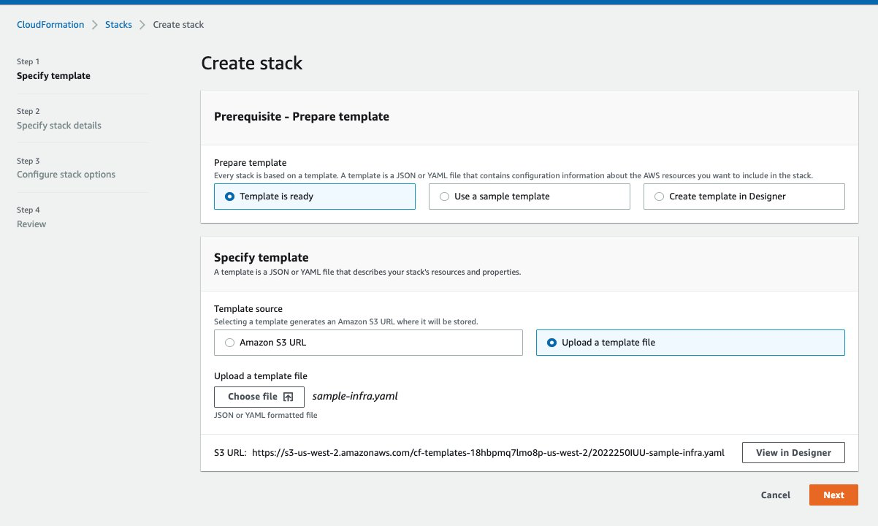
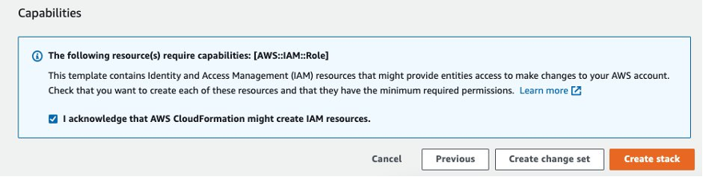
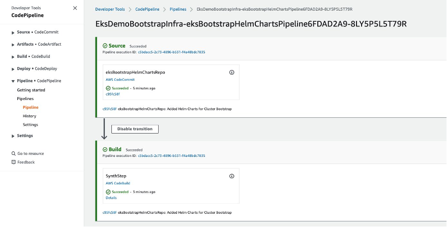
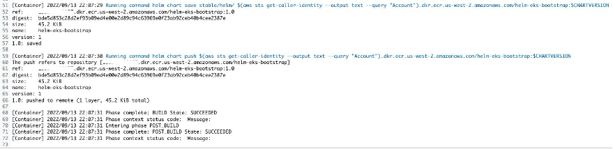
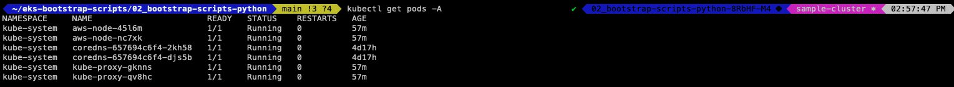
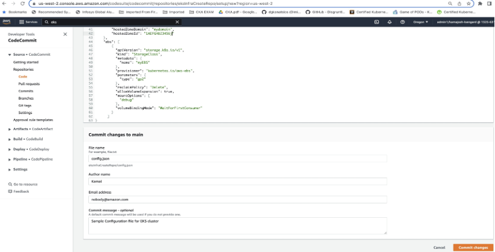
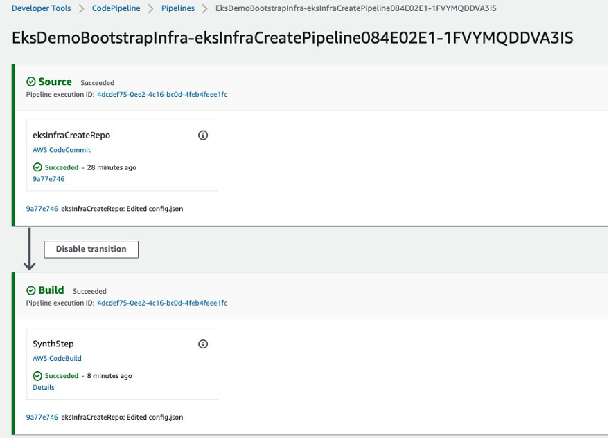
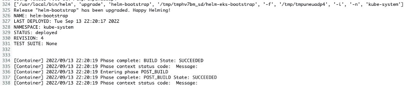
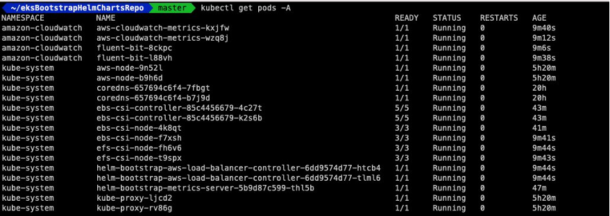
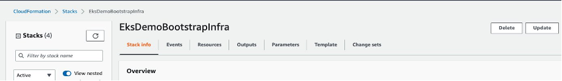

## Introduction

Kubernetes is a powerful and extensible container orchestration technology that allows you to deploy and manage containerized applications at scale. The extensible nature of Kubernetes also allows you to use a wide range of popular open-source tools, commonly referred to as add-ons, within your clusters. This allows you the flexibility to build clusters that are tailored for the unique needs of your applications, organization, and customers.  However, ensuring consistency and standardization of these configurations across a fleet of clusters can present challenges and take time.  Additionally, when building clusters with Amazon EKS, you also need to consider governing network policies, access to the EKS clusters, and even access to AWS resources that can extend beyond the boundaries of the clusters themselves.  

To address these challenges, many customers turn to automated bootstrapping.  There are a few different ways you can achieve this with EKS, but many organizations use helm with Add-Ons charts. This method allows you to easily bootstrap an EKS cluster with Amazon EKS add-ons, as well as, a wide range of popular open-source add-ons, including Prometheus, AWS Load Balancer Controller, Fluent Bit (and more) in a consistent and standardized way. 

In this post, we’ll  demonstrate how you can bootstrap Amazon EKS with helm charts stored on Amazon ECR using an AWS CodePipeline workflow. The bootstrap step integrated with the pipeline allows the customer to validate the status of each component installed in the bootstrap stage, ensuring that the Amazon EKS cluster meets the customer requirements. This post can be used to maintain deployment consistency & scalability for hundreds of Amazon EKS clusters.  

## Sample Code 

We have created a sample codebase that you can use as a foundation to build on. You can access it via the link. The project is hosted on github. It includes the following folders.
-	00_infra_setup AWS CloudFormation template to create the sample infrastructure 
-	01_eks-bootstrap-helm Helm templates for bootstrapping EKS clusters  
-	02_bootstrap-scripts-python Python cli code that are packaged as pip library in AWS CodeArtifact
-	03_sample_scripts Sample scripts for quick start

## Prerequisites 

-	An active AWS account.
-	IAM Role to create AWS resources
-	A development environment/machine with the following installed
    -	AWS CLI
    -	Python 3.7 or higher
    -	eksctl
    -	kubectl 
    -	pip
    -	pipenv 
    -	AWS CDK: '2.24.1' (Installation guide)
    -	npm '8.8.0' (Installation guide)
    -	node '18.1.0' (Installation guide)

## Architecture

  

Above architecture depicts integration with other pipeline components, but in this post we will be focusing on the architecture components as shown by dotted area.

The solution workflow will have two pipelines 
1. It will package and publish helm charts to Amazon ECR.
  -	You will commit all the helm charts to the CodeCommit repository 
  -	AWS Code Pipeline will be triggered and invokes AWS CodeBuild stage
  -	AWS Code Build stage will package helm charts to AWS ECR repository
2. It will bootstrap EKS clusters with the helm charts deployed in above step
- You will add cluster configuration to the sample repo eksInfraCreateRepo. This configuration will control the add-on configuration on the EKS cluster
- AWS Code Pipeline will be triggered and invokes AWS CodeBuild stage
- This  CodeBuild stage will run python cli script, bootstap-cli that is packaged in AWS CodeArtifactory. It will perform below steps
    - Source values from multiple contexts that are passed as command line arguments 
    - Run helm upgrade with these values

## Create initial infrastructure 

This step will create below resources
- AWS Code Commit Repository, AWS CodeBuild Project, AWS CodePipeline, Amazon ECR for packaging helm charts 
- AWS Code Commit Repository, AWS CodeBuild Project, AWS CodePipeline for bootstrapping AWS EKS Cluster.
- SSM Parameter store for storing & retrieving dynamic values.

### Steps:
1.	Set the region that you want to use for the setup. We will be using us-west-2 region for this post
    
    `export AWS_REGION="us-west-2"`
2.	Clone eks-bootstrap-scripts github repository
    
    `git clone https://github.com/aws-samples/eks-bootstrap-scripts.git`
3.	Open [CloudFormation](https://console.aws.amazon.com/cloudformation/) in the [AWS Management Console](https://aws.amazon.com/console).
4.	On the Welcome page, choose Create stack and then choose with new resources.
5.	On Step 1 — Specify template, choose Upload a template file, select Choose file and then select the file [sample-infra.yaml](https://github.com/aws-samples/eks-bootstrap-scripts/blob/main/00_infra_setup/sample-infra.yaml) under 00_infra_setup folder(cloned from Step 1) , then choose Next.



6.	On Step 2 — Specify stack details, put stack name as EksDemoBootstrapInfra, then click next
7.	Click next and on Step Review,  check - I acknowledge that AWS CloudFormation might create IAM resources.
8.	Click Create stack




## Package helm charts in ECR

This step will trigger the first pipeline and package its contents to AWS ECR repository, helm-eks-bootstrap
Steps:
1.	Navigate to [CloudCommit](https://us-west-2.console.aws.amazon.com/codesuite/codecommit/repositories/eksBootstrapHelmChartsRepo/setup?region=us-west-2) in the [AWS Management Console](https://aws.amazon.com/console). You can get detailed connection steps for https, ssh and https(grc) method. We are using HTTPS(GRC) for cloning the repo
2.	clone eksBootstrapHelmChartsRepo that is created from infrastructure creation step

    `git clone codecommit::${AWS_REGION}://eksBootstrapHelmChartsRepo`
3.	copy 01_eks-bootstrap-helm [contents](https://github.com/aws-samples/eks-bootstrap-scripts/tree/main/01_eks-bootstrap-helm) from eks-bootstrap-scripts to the CodeCommit repository eksBootstrapHelmChartsRepo. 
   
    `cp -r eks-bootstrap-scripts/01_eks-bootstrap-helm/* eksBootstrapHelmChartsRepo`
4.	Commit and push the changes
    ```
    cd eksBootstrapHelmChartsRepo
    git add .
    git commit -am 'Added Helm Charts for Cluster Bootstrap'
    git push
    ```



5.	You can click on Details for viewing the logs of this pipeline



## Publish python bootstrap cli package to AWS CodeArtifact

We are using python script to bootstrap EKS cluster. This script is distributed as pip package
The python cli for the bootstrap will run helm upgrade with values sourced from **contexts** like SSM parameters, repository config files or environment variables.
### Contexts

The bootstrap cli has a concept of "Contexts". Each context will pull variables into the helm values for deployment. Contexts are pluggable and modular. When specifying a context via the cli, the flag value should match the following format:

`<context type>:<context primary id>:<context additional configuration>`

The context type refers to the type of the context, see the list below. The primary id is a value specific to that context to configure the context. Context additional configuration is a comma separated list of key-value pairs with an "=" separator that allows specific configuration for the context. Supported contexts and their configurations are listed below:
-	`file`: take values from a JSON file, supports optional JSONPath filter
    -	Primary ID: path to the jsonfile
    - Additional Configuration:
      - pathfilter: A JSONpath query to filter parts of the input json. Requires key to be set.
      - key: The top level key to apply the filtered json to in the Helm values.
-	`environment`: Add key-value pairs from environment variables to Helm values. Supports structured variables with the "__" separator (i.e., PREFIX_A__B=C will be value {A: {B: C}}).
    - Primary ID: Environment variable prefix to use (prefix will be stripped)
    - No additional configuration
-	`varcontent`: Reads the structured content of an environment variable and adds it to the values. So far, only JSON is supported.
    -	Primary ID: The name of the variable to read
    - Additional Configuration:
        - type: The type of structured content held by the variable, currently only "json" is supported
        - key: Optional, a top level key to store the values from the json in the values, i.e., if "MyKey" is specified, the values will have {..., "MyKey": {...content from variable}, ...}
- `raw` : Set a value directly. The indicator is the path to set, the "value" option is the value that will get set.
  - Primary ID: The path of key value which need to be modified
  - value: Specifies the value need to be set.

The script takes the following flags:
```
-h, --help: show this help message and exit
--json: The path to the config JSON for setting up dynamic values
--artifact: The path to the output JSON from the previous stage containing stack output. This is required if —json is specified
--context: A context to register with helm, see details below. This flag can be set multiple times
--chart: Path to the helm chart to deploy, if not the application will pull the chart depending on the flags.
--release: Helm release name
--print_values: Print generated values.
--helm: Deploy helm Chart.
--bindserviceaccounts: Allow Helm to provision and bind IAM roles to K8S service accounts
--helm_arg Arguments to be passed to the helm upgrade command.
--upgrade: Upgrade the chart release.
--template: Print the generated template.
```
If the cli is run with `--upgrade` or `--template` command the bootstrap cli with use `install` flag for helm chart installation.

### Environment Variables used by bootstrap-cli
```
HELM_IMAGE_TAG : Specifies the tag of helm image in ECR
BOOTSTRAP_DEFAULT_REPO : Specifies the default repository for bootstrap helm charts
BOOTSTRAP_HELM_DEFAULT_IMAGE : Specifies the name of the helm image
HELM_EXPERIMENTAL_OCI: As the helm image support is an experimental feature the environment variable should be set as 1
```
### Steps:
1.	Navigate to repository [eks-bootstrap-scripts](https://github.com/aws-samples/eks-bootstrap-scripts) that is created as part of Step. *Create initial infrastructure*. This step will create [AWS CodeArtifact](https://aws.amazon.com/codeartifact/) domain and repository to store bootstrap cli pip package.
Below steps need to be done only once per AWS account & region. You will get "already exists" error for existing resources.
    ```
    cd 02_bootstrap-scripts-python
    pipenv shell
    pipenv install
    pipenv install twine 
    aws codeartifact create-domain --domain eks-bootstrap --region ${AWS_REGION}
    aws codeartifact create-repository --domain eks-bootstrap --domain-owner $(aws sts get-caller-identity --output text --query 'Account') --repository bootstrap-scripts-python --description "Python Scripts to bootstrap EKS Cluster" --region ${AWS_REGION}
    ```
    You will get output like below
    ```
    pipenv shell
    ✔ Successfully created virtual environment!

    pipenv install
    Pipfile.lock not found, creating...
    Locking [packages] dependencies...
    Building requirements...
    Resolving dependencies...
    ✔ Success!

    aws codeartifact create-domain --domain eks-bootstrap --region ${AWS_REGION}
    {
    "domain": {
    "name": "eks-bootstrap",
    "owner": "##################",
    "arn": "arn:aws:codeartifact:${AWS_REGION}:##################:domain/eks-bootstrap",
    "status": "Active",
    "createdTime": "2022-09-07T12:12:22.766000-05:00",
    "encryptionKey": "arn:aws:kms:${AWS_REGION}:##################:key/##################",
    "repositoryCount": 0,
    "assetSizeBytes": 0,
    "s3BucketArn": "arn:aws:s3:::assets-##################-${AWS_REGION}"
    }
    }

    aws codeartifact create-repository --domain eks-bootstrap --domain-owner $(aws sts get-caller-identity --output text --query 'Account') --repository bootstrap-scripts-python --description "Python Scripts to bootstrap EKS Cluster" --region ${AWS_REGION}
    {
    "repository": {
    "name": "bootstrap-scripts-python",
    "administratorAccount": "##################",
    "domainName": "eks-bootstrap",
    "domainOwner": "##################",
    "arn": "arn:aws:codeartifact:${AWS_REGION}:##################:repository/eks-bootstrap/bootstrap-scripts-python",
    "description": "Python Scripts to bootstrap EKS Cluster",
    "upstreams": [],
    "externalConnections": []
    }
    }
    ```
2.	These steps need to be done whenever there is any change in the bootstrap cli scripts . You can increment version in version.txt for any script changes. It will do authentication with CodeArtifact and publish the changes
    ```
    aws codeartifact login --tool twine --domain eks-bootstrap --domain-owner $(aws sts get-caller-identity --output text --query 'Account') --repository bootstrap-scripts-python --region ${AWS_REGION}
    python setup.py bdist_wheel
    twine upload --repository codeartifact dist/*
    ```
    You will get output like below
    ```
    aws codeartifact login --tool twine --domain eks-bootstrap --domain-owner $(aws sts get-caller-identity --output text --query 'Account') --repository bootstrap-scripts-python --region ${AWS_REGION}

    Successfully configured twine to use AWS CodeArtifact repository https://eks-bootstrap-##################.d.codeartifact.${AWS_REGION}.amazonaws.com/pypi/bootstrap-scripts-python/
    Login expires in 12 hours at 2022-09-08 00:32:08-05:00
    2.0.0

    python setup.py bdist_wheel

    installing to build/bdist.macosx-12-x86_64/wheel
    running install
    running install_lib
    creating build/bdist.macosx-12-x86_64/wheel
    creating build/bdist.macosx-12-x86_64/wheel/bootstrap
    copying build/lib/bootstrap/bootstrap.py -> build/bdist.macosx-12-x86_64/wheel/bootstrap
    copying build/lib/bootstrap/__init__.py -> build/bdist.macosx-12-x86_64/wheel/bootstrap
    copying build/lib/bootstrap/context.py -> build/bdist.macosx-12-x86_64/wheel/bootstrap
    copying build/lib/bootstrap/macros.py -> build/bdist.macosx-12-x86_64/wheel/bootstrap
    copying build/lib/bootstrap/__main__.py -> build/bdist.macosx-12-x86_64/wheel/bootstrap
    copying build/lib/bootstrap/helm.py -> build/bdist.macosx-12-x86_64/wheel/bootstrap
    warning: install_lib: byte-compiling is disabled, skipping.
    running install_egg_info
    running egg_info
    writing bootstrap_cli.egg-info/PKG-INFO
    writing dependency_links to bootstrap_cli.egg-info/dependency_links.txt
    writing entry points to bootstrap_cli.egg-info/entry_points.txt
    writing requirements to bootstrap_cli.egg-info/requires.txt
    writing top-level names to bootstrap_cli.egg-info/top_level.txt
    reading manifest file 'bootstrap_cli.egg-info/SOURCES.txt'
    writing manifest file 'bootstrap_cli.egg-info/SOURCES.txt'
    Copying bootstrap_cli.egg-info to build/bdist.macosx-12-x86_64/wheel/bootstrap_cli-2.0.0-py3.10.egg-info
    running install_scripts
    creating build/bdist.macosx-12-x86_64/wheel/bootstrap_cli-2.0.0.dist-info/WHEEL
    creating 'dist/bootstrap_cli-2.0.0-py3-none-any.whl' and adding 'build/bdist.macosx-12-x86_64/wheel' to it
    adding 'bootstrap/__init__.py'
    adding 'bootstrap/__main__.py'
    adding 'bootstrap/bootstrap.py'
    adding 'bootstrap/context.py'
    adding 'bootstrap/helm.py'
    adding 'bootstrap/macros.py'
    adding 'bootstrap_cli-2.0.0.dist-info/METADATA'
    adding 'bootstrap_cli-2.0.0.dist-info/WHEEL'
    adding 'bootstrap_cli-2.0.0.dist-info/entry_points.txt'
    adding 'bootstrap_cli-2.0.0.dist-info/top_level.txt'
    adding 'bootstrap_cli-2.0.0.dist-info/RECORD'
    removing build/bdist.macosx-12-x86_64/wheel

    twine upload --repository codeartifact dist/*

    Uploading distributions to https://eks-bootstrap-##################.d.codeartifact.${AWS_REGION}.amazonaws.com/pypi/bootstrap-scripts-python/
    Uploading bootstrap_cli-2.0.0-py3-none-any.whl
    100% ━━━━━━━━━━━━━━━━━━━━━━━━━━━━━━━━━━━━━━━━ 21.6/21.6 kB • 00:00 • 18.4 MB/s
    ```

## Create EKS cluster

Navigate to [Create an Amazon EKS cluster](https://docs.aws.amazon.com/eks/latest/userguide/create-cluster.html) for cluster creation. Alternatively, you can use any other IAC (Infrastructure as code) like terraform, AWS CDK, CloudFormation etc. and integrate these steps with AWS code pipeline as additional stages. 
To get you started sample script can be used as shown below
  ```
  cd 03_sample_scripts
  ./createCluster.sh
  aws eks update-kubeconfig --name sample-cluster --region ${AWS_REGION}
  kubectl get pods -A
  ```

  

## Create EFS file system

We are creating Amazon Elastic File system to use EFS as storage class in Amazon EKS.
  ```
  aws efs create-file-system --performance-mode generalPurpose --throughput-mode bursting --encrypted --region ${AWS_REGION} --tags Key=Name,Value=my-sample-file-system | tee efs.json
  export EFS_ID=`cat efs.json | jq -r '.FileSystemId'`
  ```

## Create IAM roles

It is good practice to create different [IAM](https://docs.aws.amazon.com/IAM/latest/UserGuide/introduction.html)(Identity & access management) roles for each service account in EKS. In this step we will be following the principle of least privilege and create multiple roles. 
For creating roles for EKS see [Creating an IAM role and policy for your service account](https://docs.aws.amazon.com/eks/latest/userguide/associate-service-account-role.html). To get you started sample script is provided. Please remember to modify the permission as per your use case
  ```
  cd 03_sample_scripts
  export CLUSTER_NAME="sample-cluster"
  ./createRoles.sh
  ```
Output of this stage should store all the values as json file. The output should be stored in SSM parameter store that will be consumed by other stages in AWS CodePipeline. For this demo, we have used SSM parameter store name as **EKS_OUT_SSM**, you can modify that per your use case
  ```
  {
      "MonitoringRole": "arn:aws:iam::${ACCOUNT_ID}:role/MonitoringRole",
      "ExternalDnsControllerRole": "arn:aws:iam::${ACCOUNT_ID}:role/ExternalDnsControllerRole",
      "EfsCsiDriverRole": "arn:aws:iam::${ACCOUNT_ID}:role/EfsCsiDriverRole",
      "EksSecurityGroup": "${CLUSTER_SG_ID}",
      "AlbControllerRole": "arn:aws:iam::${ACCOUNT_ID}:role/AlbControllerRole",
      "EksClusterName": "${CLUSTER_NAME}",
      "EbsCsiDriverRole": "arn:aws:iam::${ACCOUNT_ID}:role/EbsCsiDriverRole",
      "myVolume1" : "${EFS_ID}"
  }
  ```

## Create bootstrap stage 

This stage will be used to enable or disable any helm chart deployment and configure additional properties on the Amazon EKS cluster.

### Steps:
1.	Navigate to CloudCommit [eksInfraCreateRepo](https://us-west-2.console.aws.amazon.com/codesuite/codecommit/repositories/eksInfraCreateRepo/setup?region=us-west-2) in the [AWS Management Console](https://aws.amazon.com/console).
2.	Click on Create file and add cluster configuration in below format. We will be naming this file as config.json. You can enable/disable or modify the values based on your environment
    ```
    {
      "efscsi": {
        "enabled": true
        },
      "ebscsi": {
        "enabled": true
        },
      "efs": [
            {
                "name": "myVolume1",
                "lifecyclePolicy": "AFTER_14_DAYS",
                "performanceMode": "GENERAL_PURPOSE",
                "throughputMode": "BURSTING",
                "provisionedThroughputPerSecond": 100,
                "removalPolicy": "DESTROY",
                "storageClasses": [
                    {
                        "name": "<NAME>",
                        "retain": "Delete"
                    }
                ],
               "encrypted": true,
               "subnetIds": [
                "subnet-##############",
                "subnet-##############",
                "subnet-##############"
              ]
            }
        ],
        "createCustomNetworking": {
            "enabled": true,
            "cniSubnets": {
                "us-west-2a": "subnet-##############",
                "us-west-2b": "subnet-##############",
                "us-west-2c": "subnet-##############"
            }
        },
        "loadbalancercontroller": {
        "enabled": true
        },
        "externaldns": {
            "enabled": true,
            "hostedZoneDomain": "<HOSTED_ZONE_DOMAIN_NAME>",
            "hostedZoneId": "HOSTED_ZONE_ID"
        },
        "ebs": [
            {
              "apiVersion": "storage.k8s.io/v1",
              "kind": "StorageClass",
              "metadata": {
                "name": "<>"
              },
              "provisioner": "kubernetes.io/aws-ebs",
              "parameters": {
                "type": "gp2"
              },
              "reclaimPolicy": "Delete",
              "allowVolumeExpansion": true,
              "mountOptions": [
                "debug"
              ],
              "volumeBindingMode": "WaitForFirstConsumer"
            }
          ]
    }
    ```

    Below is the relationship between the keys in the config. json and the add-on that it configures 
    
    | Key                      |  Add-On |
    | :----------------------- | :----------------------------------:|
    | efscsi                   | [Amazon EFS CSI](https://docs.aws.amazon.com/eks/latest/userguide/efs-csi.html) |
    | ebscsi                   | [Amazon EBS CSI](https://docs.aws.amazon.com/eks/latest/userguide/managing-ebs-csi.html) |
    | efs                      | [EFS storage class](https://docs.aws.amazon.com/eks/latest/userguide/storage-classes.html) |
    | createCustomNetworking   | [Custom networking](https://docs.aws.amazon.com/eks/latest/userguide/cni-custom-network.html) |
    | ebs                      | [EBS storage class](https://docs.aws.amazon.com/eks/latest/userguide/storage-classes.html) |
    | loadbalancercontroller   | [AWS Load Balancer Controller add-on](https://docs.aws.amazon.com/eks/latest/userguide/aws-load-balancer-controller.html) |
    | externaldns              | [ExternalDNS](https://aws.amazon.com/premiumsupport/knowledge-center/eks-set-up-externaldns/) |
    
3.	Click on Commit changes. This will trigger the pipeline and bootstrap EKS cluster with the add-on helm charts from AWS ECR Repository, `helm-eks-bootstrap`.

    

    

4.	You can click on “Details” to view build stage logs.

    

5.	After pipeline execution is completed, you can view the status of add-on that we deployed using below command
    ```
    aws eks update-kubeconfig --name sample-cluster --region ${AWS_REGION}
    kubectl get pods -A
    ```
    

## Cleanup

```
./03_sample_scripts/deleteRoles.sh
aws ecr delete-repository --repository-name helm-eks-bootstrap --force
aws efs delete-file-system --file-system-id ${EFS_ID} --region ${AWS_REGION} 
aws codeartifact delete-repository --domain eks-bootstrap --domain-owner $(aws sts get-caller-identity --output text --query 'Account') --repository bootstrap-scripts-python
aws codeartifact delete-domain --domain eks-bootstrap --domain-owner $(aws sts get-caller-identity --output text --query 'Account')
helm delete helm-bootstrap -n kube-system
eksctl delete cluster -f ./03_sample_scripts/eksctl-config.yaml
```
  Open CloudFormation in the AWS Management Console. Select EksDemoBootstrapInfra and click on Delete

  

## Conclusion
 
In this post, we have discussed how you can bootstrap EKS clusters in an automated way using helm charts stored in Amazon ECR. We have also provided guidance on how to integrate the bootstrapping process with CI/CD (Continuous integration/ Continuous deployment) automation.  In addition to that, the provided codebase is completely opensource and a great starting point that can be enhanced to meet your specific use case for installing additional add-ons. 

Feel free to use this as guidance to automate your AWS EKS cluster bootstrapping process.

## Contributors
- Kamal Joshi
- Michael Katica
- Sumith C P