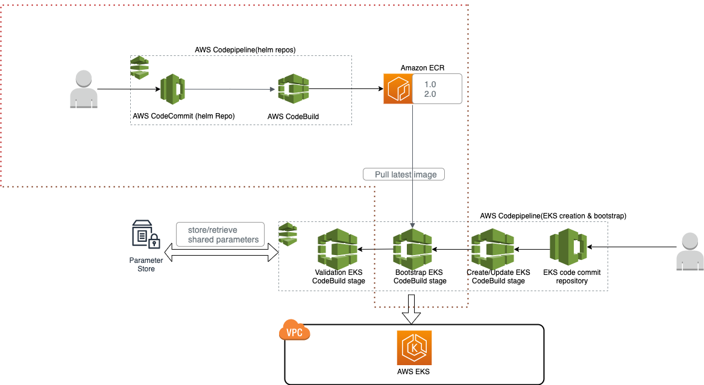

### High Level flow!



### Push helm charts to ecr repo. Make sure you have aws cli credentials & EKS cluster for deploying charts(not required for printing values & rendering helm templates) 

- `cd 01_eks-bootstrap-helm`
- `./build-d0.sh 1.0` 

### Uploading new python bootstrap cli version
- These steps need to be done once  if domain & repository does not exists. Please copy the AWS CLI credentails
- `cd 02_bootstrap-scripts-python`
- `pipenv shell` ***Make sure pipenv is installed https://pipenv.pypa.io/en/latest/install/ ***
- `pipenv install`
- `aws codeartifact create-domain --domain eks-bootstrap --region us-west-2`
- `aws codeartifact create-repository --domain eks-bootstrap --domain-owner $(aws sts get-caller-identity --output text --query 'Account') --repository bootstrap-scripts-python --description "Python Scripts to bootstrap EKS Cluster" --region us-west-2` 
- These steps need to be done for any new version
- ` aws codeartifact login --tool twine --domain eks-bootstrap --domain-owner $(aws sts get-caller-identity --output text --query 'Account')  --repository bootstrap-scripts-python --region us-west-2 `
- update version.txt with new value
- `python setup.py bdist_wheel`
- `pipenv install twine`
- `twine upload --repository codeartifact dist/* `

### Testing the setup
- `aws codeartifact login --tool pip --repository bootstrap-scripts-python --domain eks-bootstrap --domain-owner $(aws sts get-caller-identity --output text --query 'Account') --region us-west-2`
- `pip install bootstrap-cli`
- `export HELM_EXPERIMENTAL_OCI=1`
- `export BOOTSTRAP_DEFAULT_REPO=$(aws sts get-caller-identity --output text --query 'Account').dkr.ecr.us-west-2.amazonaws.com`
- `export BOOTSTRAP_HELM_DEFAULT_IMAGE=helm-eks-bootstrap`
- `export HELM_IMAGE_TAG=1.0`
- `export HELMD_awslbc__clusterName=<CLUSTER_NAME>`
- `export HELMD_global__clusterName=<CLUSTER_NAME>`
- `aws ecr get-login-password --region us-west-2 | docker login --username AWS --password-stdin $(aws sts get-caller-identity --output text --query 'Account').dkr.ecr.us-west-2.amazonaws.com`
- ### sample file for dynamic value from previous stages. 
  ```
    {
      "MonitoringRole": "arn:aws:iam::<ACCOUNT_ID>:role/<ROLE_NAME>",
      "ExternalDnsControllerRole": "arn:aws:iam::<ACCOUNT_ID>:role/<ROLE_NAME>",
      "EfsCsiDriverRole": "arn:aws:iam::<ACCOUNT_ID>:role/<ROLE_NAME>",
      "EksSecurityGroup": "sg-#############",
      "AlbControllerRole": "arn:aws:iam::<ACCOUNT_ID>:role/<ROLE_NAME>",
      "EksClusterName": "<EKS_CLUSTER_NAME>",
      "EbsCsiDriverRole": "arn:aws:iam::<ACCOUNT_ID>:role/<ROLE_NAME>",
  }
  ```
- ### sample file for cluster config file in the repository 
  ```
    {
      "efscsi": {
        "enabled": true
        },
      "ebscsi": {
        "enabled": true
        },
      "efs": [
            {
                "name": "myVolume1",
                "lifecyclePolicy": "AFTER_14_DAYS",
                "performanceMode": "GENERAL_PURPOSE",
                "throughputMode": "BURSTING",
                "provisionedThroughputPerSecond": 100,
                "removalPolicy": "DESTROY",
                "storageClasses": [
                    {
                        "name": "<NAME>",
                        "retain": "Delete"
                    }
                ],
               "encrypted": true,
               "subnetIds": [
                "subnet-##############",
                "subnet-##############",
                "subnet-##############"
              ]
            }
        ],
        "createCustomNetworking": {
            "enabled": true,
            "cniSubnets": {
                "us-west-2a": "subnet-##############",
                "us-west-2b": "subnet-##############",
                "us-west-2c": "subnet-##############"
            }
        },
        "loadbalancercontroller": {
        "enabled": true
        },
        "externaldns": {
            "enabled": true,
            "hostedZoneDomain": "<HOSTED_ZONE_DOMAIN_NAME>",
            "hostedZoneId": "HOSTED_ZONE_ID"
        },
        "ebs": [
            {
              "apiVersion": "storage.k8s.io/v1",
              "kind": "StorageClass",
              "metadata": {
                "name": "<>"
              },
              "provisioner": "kubernetes.io/aws-ebs",
              "parameters": {
                "type": "gp2"
              },
              "reclaimPolicy": "Delete",
              "allowVolumeExpansion": true,
              "mountOptions": [
                "debug"
              ],
              "volumeBindingMode": "WaitForFirstConsumer"
            }
          ]
    }
    ```
Print helm chart with these sample values & rendered template for various context:
- `bootstrap-cli --release helm-bootstrap --json "./test/config.json" --artifact "./test/artifact.json" --print_values --template --context environment:HELMD_ `

Install helm chart template with these sample value for various context:
- `bootstrap-cli --release helm-bootstrap --json "./test/config.json" --artifact "./test/artifact.json" --upgrade --context environment:HELMD_ --helm_arg='-n kube-system'`

## License
This library is licensed under the MIT-0 LICENSE. See the LICENSE file.

## Contributors
- Kamal Joshi
- Michael Katica 
- Sumith C P
 

